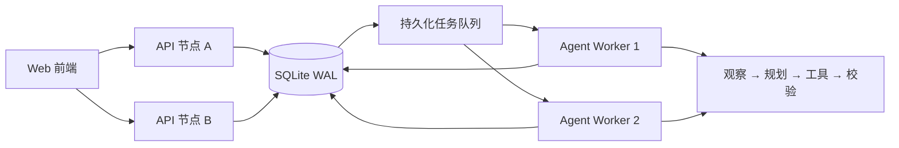

# OrbitOps · 分布式 AI 项目运营台

一个适合 C++ 实习展示与二次开发的全栈项目：C++20 编写 HTTP API、持久化任务队列和 AI Agent Worker，SQLite 负责事务与数据存储，原生 Web 前端提供项目总览、看板、Agent 工作流追踪和集群监控。

默认不依赖云服务或 API Key，一条命令即可运行完整系统。API 与 Worker 也可以拆成独立进程或容器横向扩展。

## 核心能力

- 完整业务闭环：项目与任务 CRUD、筛选、看板拖拽、优先级、进度和活动日志
- 可解释 AI Agent：`Intake → Observe → Plan → Act → Verify` 五阶段工作流
- 分布式执行：API/Worker 角色分离、SQLite WAL 持久化队列、任务租约、超时接管、指数退避与最多三次重试
- 一致性保护：请求幂等键、任务去重键、白名单工具调用、执行后数据校验
- 可观测性：节点注册与心跳、队列状态、Agent 步骤留痕、`/metrics` Prometheus 指标
- 工程化：CMake 与 Make 双构建、单元测试、跨进程 E2E 测试、Docker Compose 多节点示例
- 高效运行：原生二进制、HTTP 线程池、SQLite WAL、预编译语句、索引与内存临时表

## 架构



本地演示使用 SQLite，实现同一主机或共享 Docker Volume 上的多进程协调。若要跨主机大规模部署，持久层接口已集中封装在 `Database` 类中，可替换为 PostgreSQL，任务层可迁移到 Redis Streams 或 Kafka；业务 API 与 Agent 工作流无需改变。

## 快速启动

### Windows（MinGW）

要求：支持 C++20 的 GCC、GNU Make、PowerShell。

```powershell
.\scripts\build.ps1
.\scripts\run.ps1
```

浏览器访问 <http://127.0.0.1:8080>。

### Linux / macOS

```bash
make -j$(nproc)
./build/orbitops --role all
```

### CMake

```bash
cmake -S . -B build -DCMAKE_BUILD_TYPE=Release
cmake --build build --parallel
./build/orbitops
```

首次运行会自动创建 `data/orbitops.db`、执行数据库迁移并写入演示数据。

## 分布式运行

在不同终端启动 API 和多个 Worker。它们共享同一个数据库文件：

```powershell
# 终端 1：只运行 Web/API
.\build\orbitops.exe --role api --port 8080 --node-id api-1

# 终端 2、3：运行两个 Agent Worker
.\build\orbitops.exe --role worker --node-id worker-1
.\build\orbitops.exe --role worker --node-id worker-2
```

或用 Docker Compose 启动一个 API 和两个 Worker：

```bash
docker compose up --build
```

可在网页「集群状态」查看节点心跳和队列，也可以访问 `/metrics` 接入 Prometheus。

## AI Agent 如何工作

用户提交自然语言目标后，API 返回 `202 Accepted` 并立即将工作放入队列：

1. **Intake**：理解目标，确定 `preview` 或 `execute` 安全边界。
2. **Observe**：读取项目、任务、截止日期、工作量与负责人等实时上下文。
3. **Plan**：识别逾期、未分配、评审堆积等信号，生成带理由的工具调用计划。
4. **Act**：预览模式不写数据；执行模式只允许调用已注册的任务创建/更新工具。
5. **Verify**：重新读取数据库，核对工具结果与项目数据一致性。

内置 Agent 是确定性、离线可运行的，因此测试稳定且无需付费 API。`AgentWorkflow` 的规划阶段可以进一步接入 Ollama 或任意 OpenAI-compatible 模型，而执行工具和验证边界仍由 C++ 服务控制。

## API 概览

| 方法 | 路径 | 说明 |
|---|---|---|
| `GET` | `/api/health` | 服务健康检查 |
| `GET` | `/api/dashboard` | 总览聚合数据 |
| `GET/POST` | `/api/projects` | 查询、创建项目 |
| `GET/PATCH/DELETE` | `/api/projects/{id}` | 项目详情、更新、删除 |
| `GET/POST` | `/api/tasks` | 查询、创建任务 |
| `GET/PATCH/DELETE` | `/api/tasks/{id}` | 任务详情、更新、删除 |
| `POST` | `/api/agent/runs` | 异步提交 Agent 工作流 |
| `GET` | `/api/agent/runs/{id}` | 查询工作流和步骤 |
| `GET` | `/api/cluster` | 节点与队列状态 |
| `GET` | `/metrics` | Prometheus 文本指标 |

创建 Agent 工作流示例：

```bash
curl -X POST http://127.0.0.1:8080/api/agent/runs \
  -H "Content-Type: application/json" \
  -H "Idempotency-Key: sprint-plan-001" \
  -d '{"project_id":1,"goal":"为下轮迭代制定计划并识别风险","mode":"execute"}'
```

## 测试

```powershell
.\scripts\test.ps1
```

测试分为两层：

- `orbitops_tests`：19 项数据层、Agent、幂等、队列租约与节点发现断言。
- `tests/e2e_test.py`：启动独立 API/Worker 进程，验证 Web、REST、幂等请求、持久化队列、Agent 执行、集群发现和监控指标，共 13 项断言。

## 项目结构

```text
include/orbit/       C++ 公共接口
src/                 数据库、HTTP、Agent、Worker 与程序入口
web/                 零构建的响应式 Web 前端
tests/               单元测试与跨进程端到端测试
scripts/             Windows 构建、运行、测试脚本
third_party/         固定版本的 httplib、nlohmann/json、SQLite
CMakeLists.txt       CMake 构建定义
Makefile             GNU Make 构建定义
Dockerfile           生产镜像
docker-compose.yml   API + 双 Worker 演示集群
```

## 技术选型

- C++20、[cpp-httplib](https://github.com/yhirose/cpp-httplib)
- SQLite 3.50.4（WAL 模式）
- [nlohmann/json](https://github.com/nlohmann/json)
- HTML5、CSS3、原生 JavaScript

## License

本项目使用 MIT License。第三方依赖保留其各自许可证。
