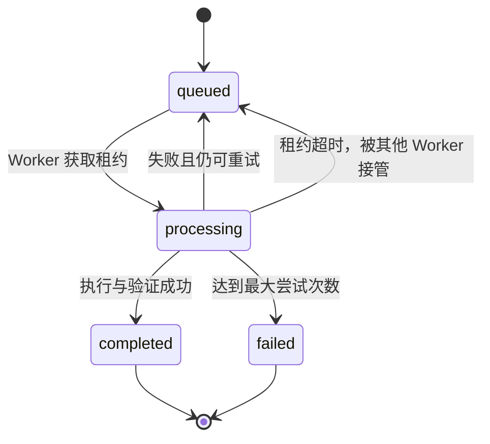
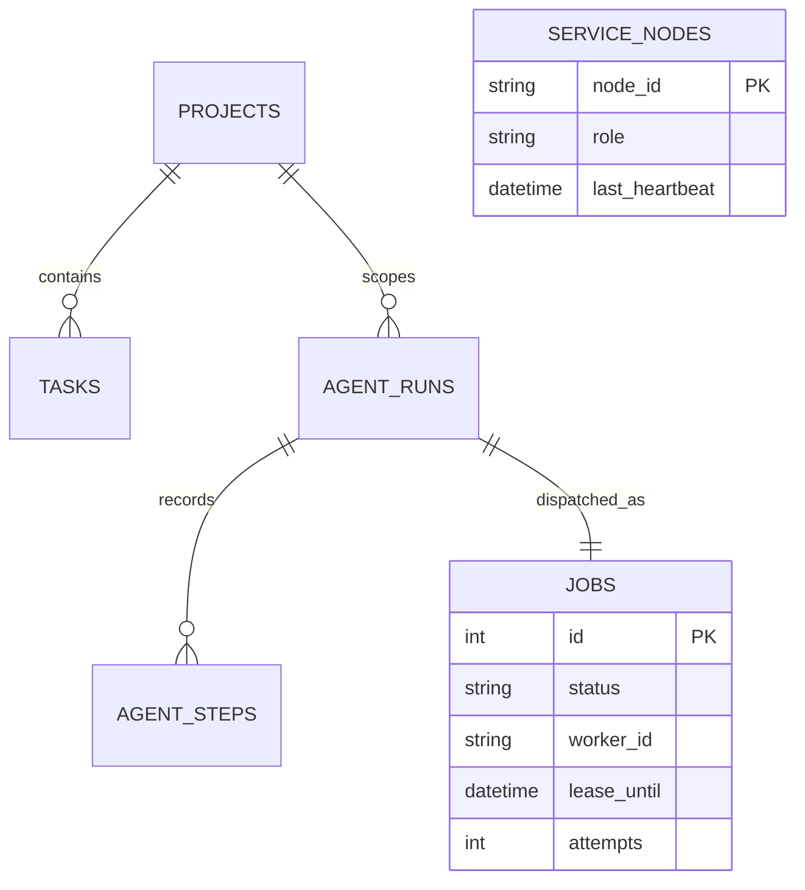

# OrbitOps 架构说明

## 设计目标

OrbitOps 同时满足两个场景：单机上开箱即用，以及在不修改业务代码的前提下将 API 与 Agent 执行器拆开部署。核心设计原则是请求快速返回、工作可靠落盘、执行可重试、结果可解释。

## 进程角色

| 角色 | 职责 | 是否有状态 |
|---|---|---|
| `api` | REST 接口、静态 Web、参数校验、任务入队、查询结果 | 无本地会话状态 |
| `worker` | 领取 Agent 任务、运行五阶段工作流、写入步骤与结果 | 仅持有短期任务租约 |
| `all` | 在一个进程内同时运行 API 与 Worker，方便本地开发 | 同上 |

API 创建 `agent_runs` 后，将带唯一 `dedupe_key` 的任务写入 `jobs`。Worker 使用 `BEGIN IMMEDIATE` 事务领取最早可用任务，同时写入 `worker_id`、尝试次数和 `lease_until`。只有持有对应租约的 Worker 能完成或回退任务。

## 任务状态机

重试等待时间按 `attempts²` 秒增加，最大 30 秒。默认最多尝试三次。Worker 异常退出时不需要显式恢复，租约到期后任务会自动重新进入可领取范围。

## 数据模型

SQLite 启用 WAL、外键、5 秒 busy timeout、NORMAL synchronous 和针对队列/任务查询的组合索引。初始化演示数据也在 `BEGIN IMMEDIATE` 中完成，避免多个服务首次并发启动时重复写入。

## Agent 安全边界

- `preview` 模式生成完整计划但不修改业务数据。
- `execute` 模式只调用 C++ 注册的 `create_task` 和 `update_task` 工具。
- 单次规划最多提升三个风险任务，并生成有限数量的拆解任务。
- 所有动作记录执行实体 ID，完成后重新观察项目并运行一致性检查。
- 任一阶段异常会记录 `error` 步骤，将运行标记为失败，并交由队列决定是否重试。

## 扩展建议

当前实现适合单机多进程和同一 Docker 主机。更高规模下建议保持 `Database` 与任务接口不变，替换以下基础设施：

- SQLite → PostgreSQL，使用 `SELECT ... FOR UPDATE SKIP LOCKED` 领取任务；
- 数据库队列 → Redis Streams、NATS JetStream 或 Kafka；
- 单点静态前端 → CDN；
- `/metrics` → Prometheus，节点日志 → Loki/ELK；
- API 前增加 Nginx、Traefik 或云负载均衡器。

业务接口、前端和 `AgentWorkflow` 不依赖具体队列产品，因此迁移边界清晰。
